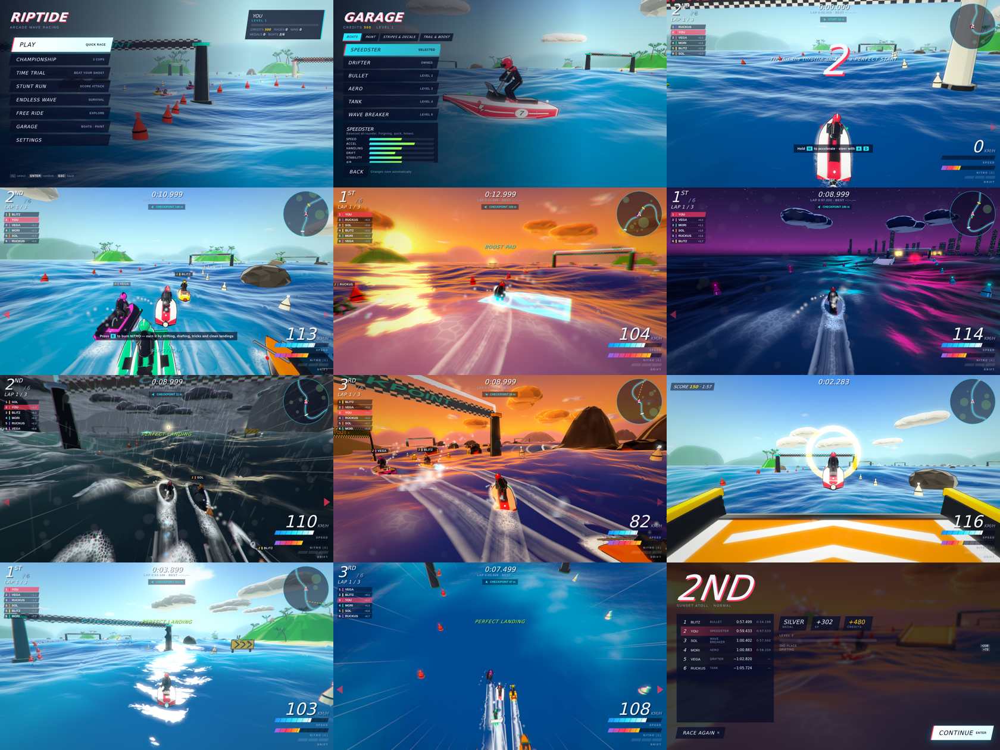

# RIPTIDE — Arcade Wave Racing

A complete arcade water-racing game for the browser, built entirely from code:
every mesh, texture, sound and music note is generated procedurally. There are
no image, model or audio files in the project.

TypeScript · Vite · three.js (WebGL2) · Web Audio API · no backend.



```bash
npm install
npm run dev        # → http://localhost:5173
npm run build      # typecheck + production build into dist/
npm run preview    # serve the production build on :4173
```

## Controls

| Action | Keyboard | Gamepad (standard mapping) |
|---|---|---|
| Throttle | `W` / `↑` | RT |
| Brake / reverse | `S` / `↓` | LT |
| Steer | `A` `D` / `←` `→` | Left stick |
| Drift (hold through a turn, release for boost) | `Shift` / `Space` | A / RB |
| Nitro (hold) | `E` / `Left Ctrl` | X |
| Air tricks | in the air: `Drift` + `↑` front flip, `Drift` + `↓` back flip, `Drift` + `←/→` 360 spin | same with stick |
| Barrel roll (air) | `Q` | LB |
| Air pitch | `W` / `S` while airborne | Left stick Y |
| Camera (close / far / bow / cinematic / aerial) | `C` | Y |
| Pause | `Esc` / `P` | Start |
| Restart | `R` | Back |
| Respawn on course | `T` | R3 |
| Menus | arrows / WASD, `Enter`, `Esc`, or mouse | D-pad / stick, A, B |

Every keyboard binding can be changed in **Settings → Controls**.

## How it plays

- **Drift** is the core skill. Hold drift while steering at speed: the hull kicks
  out into a slide while the boat's path carves the corner. Steering into the
  turn tightens it, counter-steer widens it. The drift meter fills through three
  colour tiers (blue → orange → pink); release for a mini-turbo whose length
  depends on the tier.
- **Nitro** is a reserve you spend by holding the nitro button. You earn it by
  drifting, drafting behind rivals (a SLIPSTREAM indicator appears), tricks,
  clean landings, boost pads and stunt rings.
- **Air** comes from ramps and from real wave crests — swell zones on each track
  build bigger seas, storms make everything bigger. In the air you can trim
  pitch, flip, spin and barrel-roll. Land level and aligned with the course for
  a PERFECT LANDING boost; land mid-trick or badly and you wipe out.
- **Readability**: buoy-marked edges, chevron corner signs, a glowing arch on
  the next checkpoint, a checkpoint direction pointer, a rotating minimap,
  rival name tags with positions, edge arrows for boats alongside, an optional
  racing-line assist (Settings → Gameplay), and an unmissable WRONG WAY banner.
- **Starts**: holding the throttle when "2" shows floods the engine (FALSE START,
  1.2 s penalty). Hitting the throttle on "1" gives a PERFECT START launch.
- **Shortcuts**: every course has a narrow channel through the rocks, marked
  with yellow buoys and a SHORTCUT sign. It saves distance and costs nerve.

## Game modes

| Mode | |
|---|---|
| Quick Race | 6 boats, 1–5 laps, easy / normal / hard AI, any weather |
| Championship | Three cups (3 or 6 races). Points 10-8-6-5-4-3, standings between rounds, trophy at the end |
| Time Trial | Solo laps against medal targets and your saved best-lap **ghost** |
| Stunt Run | Two minutes to score with tricks, drifts, clean landings and rings |
| Endless Wave | The sea keeps rising and mines drift in; checkpoints add time |
| Free Ride | No clock — explore the course, chase rings, practise |

## Content

- **6 courses** across 4 themes — Coral Cove and Sunset Atoll (tropical bay),
  Thunderhead Coast (storm coast), Neon Harbor and Shipyard Sprint (harbour /
  industrial docks), Cinder Strait (volcanic waters). Each has gates, buoy-marked
  edges, chevron corner signs, ramps, boost pads, swell zones, hazards, a
  shortcut and themed scenery (palms, huts, docks, waterfall; cliffs,
  lighthouses with sweeping beams, a wreck, a bridge; container barges, gantry
  cranes, quays, a lit skyline; basalt, lava rocks, steam vents, a volcano).
- **4 weathers** for any course — clear, sunset, storm (rain, lightning,
  thunder, much bigger swell), night (stars, moon, neon reflections).
- **6 watercraft** with distinct hulls and handling: SPEEDSTER (balanced),
  DRIFTER (loose and twitchy), BULLET (top speed), AERO (air control), TANK
  (twin-hull bruiser), WAVE BREAKER (deep-V, eats swell).
- **5 AI rivals** with personalities (aggressive, technical, speed, balanced,
  reckless): different lanes, drift habits, shortcut and ramp choices, nitro
  strategy, deliberate mistakes, traffic behaviour and stuck recovery.
- **Garage**: buy boats, then customise hull and accent colour, stripe pattern,
  race number, decal, wake-trail tint and boost-flame colour — painted live on
  the 3D hull.
- **Progression**: XP and levels (unlock courses, cups, boats, paint, decals,
  trail and flame colours), credits, medals per course and mode, records,
  championship trophies, unlock toasts.

## Architecture

```
src/
  core/        game orchestrator (state machine, harness API), math, rng, events, types
  water/       waves.ts — THE wave field (CPU + GLSL); ocean mesh/shader; wakes & hull foam
  boat/        specs, state, physics (buoyancy, handling, drift, boost, tricks), collisions, meshes
  race/        course generator, track queries, race session (all mode rules), racers
  ai/          AI drivers
  environment/ layout (pure data), scenery visuals, props, sky, weather presets, atmosphere
  render/      renderer + post stack + adaptive resolution, cel materials/outlines, course furniture, FX director, world
  camera/      chase/bow/cinematic/aerial rig with shake and comfort scaling
  particles/   pooled GPU point particles
  audio/       synthesised SFX/engines and procedural music sequencer
  ui/          menus, HUD, minimap, spatial navigation, styles
  input/       keyboard + gamepad, rebindable
  save/        validated localStorage save, progression, rewards
  debug/       ?debug=1 overlay, GPU↔CPU wave agreement check
harness/       Playwright + tsx test and capture scripts
```

Rules the code follows:

1. **One wave field.** `src/water/waves.ts` defines the Gerstner wave table,
   the swell-zone envelope, the GLSL (`WAVE_GLSL`) and the CPU mirror
   (`oceanHeight` / `sampleOcean`). The ocean, wakes, hull foam, boost pads and
   racing line displace with the GLSL; boats, buoys, mines, the camera and the
   AI sample the CPU side. Both use the same fixed-point inverse for horizontal
   Gerstner displacement. `harness/gameplay-test.mjs` renders the GLSL into a
   float target and checks it against the CPU: max error is under 2 cm.
2. **The simulation is headless.** `RaceSession` runs without a renderer and
   communicates with presentation through an event queue. The race can be
   simulated in Node (`npx tsx harness/sim-probe.ts`).
3. **AI drives the same `Controls` as the player.** No AI-only forces.
4. **No allocation in the frame loop** for physics, particles, wakes and
   instanced updates (preallocated scratch objects and pooled buffers).

Frame order: input → simulation (sub-stepped physics, collisions, progress,
mode rules) → camera → world visuals → HUD → audio → render.

## Testing and tooling

All harness scripts drive the real game in headless Chromium through
`window.__RIPTIDE__` (enabled with `?harness=1`), which owns a fixed-step clock
so results are deterministic.

```bash
npm run dev &                          # or build + preview
npm test                               # 29 automated gameplay tests
node harness/capture.mjs --list        # named screenshot scenarios
node harness/capture.mjs --shots=racing,storm,night --out=shots
npx tsx harness/sim-probe.ts coral     # headless full race, numeric report
node harness/perf.mjs --url=http://localhost:4173/   # real-clock perf sampling
```

The gameplay suite covers: GPU/CPU wave agreement, race start sequence,
flotation, acceleration, checkpoints and AI progress, finish and results,
progression saved to localStorage, wrong-way detection, respawn, pause/resume,
restart, drift tiers and boost release, ramp launch and landing, every mode,
stunt timer, ghost saving, championship rounds and finale, garage persistence,
settings persistence, key rebinding, viewport resizing, a clean console,
reload persistence, corrupted/hostile save data, gamepad driving and gamepad
menu navigation, and keyboard-only menu flow.

`?debug=1` shows FPS, frame time, CPU cost of simulation + update, draw calls,
triangles, heap, particles, sea state, and live boat/race state, with toggles
for autopilot, slow-motion, bloom, outlines, HUD, weather, ocean wireframe,
nitro, respawn and adaptive resolution.

## Performance

Measured in this project's development container, which has **no GPU**:
Chromium falls back to SwiftShader (software rasterisation on the CPU), so
real frame rates could not be measured here. What could be measured:

| | |
|---|---|
| CPU per frame, simulation + all scene updates, 6 boats (`perf.mjs`) | **0.76 ms** |
| Draw calls mid-race (high quality, 6 boats, scenery, post) | ~110–125 |
| Triangles mid-race | ~300–360 k |
| GPU resources across repeated race loads | stable (no leaks) |

Systems in place for real hardware: instanced props with outlines sharing the
instance buffer, merged islands/gates/signs, one draw call for all wakes and
one for all hull-foam collars, pooled particles (two draw calls), GPU-animated
rain, a camera-centred radial ocean grid with distance band-limiting, three
quality presets (ocean density, MSAA, bloom, particle budget, rain density), a
user pixel-ratio cap, and an adaptive resolution controller driven by median
frame time. Run `node harness/perf.mjs` on a machine with a GPU for real
numbers.

## Known limitations

- Frame rate on real GPUs has not been measured (see above).
- Audio was verified by measuring the output signal (levels, no clipping, mood
  changes), not by listening.
- Wake and spray are stylised approximations: there is no wave–wake interaction
  between boats, and spray is billboarded points rather than fluid.
- Boats do not cast shadows; contact is conveyed with foam collars instead.
- Tracks are generated from harmonic radius profiles, so every course is a
  single closed loop (shortcuts are the only branches).
- Touch controls are not implemented; desktop keyboard/gamepad is the target.
